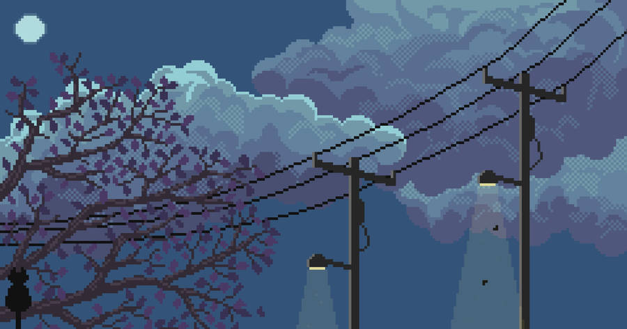

Hi, I'm Berker. Some things I've been working on:

  

**[Marcel](https://github.com/berker-z/marcel)**

A fast, preview-first graphical file manager for Linux, built with Rust and GPUI.

**[hyprhands](https://github.com/berker-z/hyprhands)**

Computer use for Hyprland, with persistent per-app memory so agents can learn how programs work across sessions.

**[uwu-unstucker](https://github.com/berker-z/uwu-unstucker)**

A local Solana transaction rebuilder I wrote to recover an airdrop from a broken sponsored claim flow. It deserializes the captured transaction, rebuilds it with the correct parameters, then simulates and sends it.

**[nord-dash](https://github.com/berker-z/nord-dash)**

My personal dashboard for calendars, markets, notes, tasks, and whatever else ends up there.

**[dotfiles](https://github.com/berker-z/dotfiles)**

NixOS config, for the curious.
