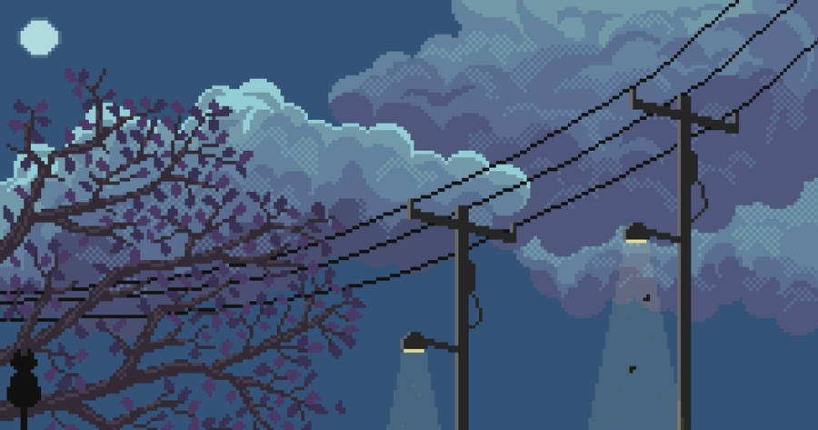

Hi, I'm Berker. Some things I've been working on:

  

**[Marcel](https://github.com/berker-z/marcel)**

A fast, preview-first graphical file manager for Linux, built with Rust and GPUI.

**[hyprhands](https://github.com/berker-z/hyprhands)**

Computer use for Hyprland, with persistent per-app memory so agents can learn how programs work across sessions.

**[copland](https://github.com/berker-z/copland)**

A self-hosted workspace and AI agent coordination system. Project boards, MCP, agent identities, and a local daemon that dispatches work to the runtimes you already use. Also a personal dashboard when you want one.

**[kino](https://github.com/berker-z/kino)**

A composable motion-design toolkit for HyperFrames. Reusable procedural visuals, animation primitives, rendering passes, and aesthetic systems for code-driven video, including audio-reactive work.

**[uwu-unstucker](https://github.com/berker-z/uwu-unstucker)**

A local Solana transaction rebuilder I wrote to recover an airdrop from a broken sponsored claim flow. It deserializes the captured transaction, rebuilds it with the correct parameters, then simulates and sends it.

**[dotfiles](https://github.com/berker-z/dotfiles)**

NixOS config, for the curious.
